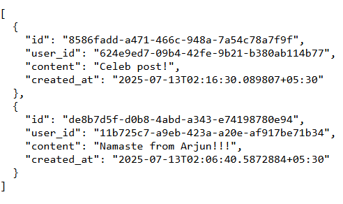

# News Feed System

## Overview
The news feed system mimics the core functionality of social media platforms like Twitter or Facebook, where users can:

- Create profiles and follow other users.
- Post content (text-based posts in this implementation).
- View a personalized feed of posts from users they follow, sorted by recency.

The implementation uses a hybrid fan-out approach (fan-out on write for users with < 1000 followers, fan-out on read for others) to balance latency and scalability, as outlined in Alex Xu’s book. It’s designed with a clean folder structure, RESTful APIs, and an in-memory store to simulate database and caching layers.

## Key Features

- <b>Feed Publishing: </b>Users can create posts via a RESTful API, which are stored and optionally pushed to followers’ feeds (fan-out on write).

- <b>Feed Retrieval: </b>Users can fetch their personalized feed, either from precomputed feeds (fan-out on write) or by dynamically aggregating posts (fan-out on read).

- <b>Hybrid Fan-Out</b>:
    1. <b>Fan-Out on Write:</b> Pushes posts to followers’ feeds at write time for users with < 1000 followers, ensuring low-latency feed retrieval.

    2. <b>Fan-Out on Read:</b> Dynamically fetches posts for users with many followers (e.g., celebrities) to optimize storage and scalability.

- <b>Storage: </b>Uses an in-memory store (MemoryStore) to simulate databases (e.g., MySQL for users/relationships, Redis/Cassandra for posts/feeds).


- <b>Caching: </b>Simulates caching with an in-memory store for precomputed feeds.

- <b>Ranking: </b>Sorts posts by timestamp (descending); extendable to engagement-based ranking (e.g., likes, comments).

- <b>API: </b>Provides RESTful endpoints using the Go-Chi router for user creation, following, posting, and feed retrieval.

- <b>Concurrency: </b>Thread-safe data access using <i>sync.RWMutex</i> in the in-memory store


#### Step 1: Create a User
````````````````````````
curl -X POST -H "Content-Type: application/json" -d '{"username":"Aditya"}' http://localhost:8080/users
````````````````````````

<b>Output</b>:
````````````````````````
{"id":"a9fbf403-3a8e-4165-9918-06033647cfde","username":"Aditya","Followers":{}}
````````````````````````

#### Step 2: Creating another User
````````````````````````
curl -X POST -H "Content-Type: application/json" -d '{"username":"Arjun"}' http://localhost:8080/users
````````````````````````

<b>Output</b>:
````````````````````````
{"id":"11b725c7-a9eb-423a-a20e-af917be71b34","username":"Arjun","Followers":{}}
````````````````````````

#### Step 3: Establishing follow relationship
````````````````````````
curl -X POST -H "Content-Type: application/json" -d '{"follower_id":"a9fbf403-3a8e-4165-9918-06033647cfde","followee_id":"11b725c7-a9eb-423a-a20e-af917be71b34"}' http://localhost:8080/follow    
````````````````````````

#### Step 4: Post is being created by Arjun
````````````````````````
curl -X POST -H "Content-Type: application/json" -d '{"user_id":"11b725c7-a9eb-423a-a20e-af917be71b34","content":"Namaste from Arjun!!!"}' http://localhost:8080/posts
````````````````````````

#### Step 5: Creating a celebrity user
````````````````````````
curl -X POST -H "Content-Type: application/json" -d '{"username":"celeb"}' http://localhost:8080/users
````````````````````````

#### Step 6: Establishing a follow relationship of Celebrity with Aditya
````````````````````````
curl -X POST -H "Content-Type: application/json" -d '{"follower_id":"a9fbf403-3a8e-4165-9918-06033647cfde","followee_id":"624e9ed7-09b4-42fe-9b21-b380ab114b77"}' http://localhost:8080/follow
````````````````````````

#### Step 7: Post created by Celebrity
````````````````````````
curl -X POST -H "Content-Type: application/json" -d '{"user_id":"624e9ed7-09b4-42fe-9b21-b380ab114b77","content":"Celeb post!"}' http://localhost:8080/posts
````````````````````````
<b>Output</b>:
````````````````````````
{"id":"8586fadd-a471-466c-948a-7a54c78a7f9f","user_id":"624e9ed7-09b4-42fe-9b21-b380ab114b77","content":"Celeb post!","created_at":"2025-07-13T02:16:30.089807+05:30"}
````````````````````````

#### Step 8: Aditya's Feed
````````````````````````
curl http://localhost:8080/feed/a9fbf403-3a8e-4165-9918-06033647cfde
````````````````````````
<b>Output: </b>



Made with curiosity 💡